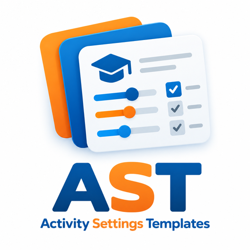

# Plantillas de configuración de actividades

<p align="center">
  
</p>

**Activity Settings Templates** (`local_activitysettingstemplates`), en español **Plantillas de configuración de actividades**, es un plugin local para Moodle centrado en el docente. Permite guardar las configuraciones seleccionadas de actividades como plantillas personales reutilizables y aplicarlas posteriormente a actividades del mismo tipo.

> Versión pública: **1.0.0**  
> Moodle: **4.5–5.2**  
> Licencia: **GNU GPL v3 o posterior**

## Objetivo

El plugin busca reducir el trabajo repetitivo, las inconsistencias y la carga cognitiva durante la configuración de actividades. El docente puede reutilizar decisiones de configuración sin duplicar contenido ni sustituir el flujo nativo de Moodle.

Una plantilla representa **configuraciones**, no una copia de la actividad.

## Funciones principales

- Crear plantillas personales a partir de actividades ya configuradas.
- Elegir exactamente qué configuraciones forman parte de la plantilla.
- Aplicar la plantilla desde el formulario de configuración nativo de Moodle.
- Mostrar solo las plantillas compatibles con el tipo de actividad actual.
- Vista previa de las configuraciones antes de aplicarlas.
- Análisis de compatibilidad con los estados **Aplicable**, **Atención** y **No aplicable**.
- Uso combinado de color, icono y texto para no depender únicamente del color.
- Aplicación segura sin forzar campos bloqueados o no disponibles.
- Segundo intento automático de controles dependientes tras de reacción de las reglas del formulario de Moodle.
- Edición de nombre, la descripción, las configuraciones incluidas y los valores almacenados.
- Gestión de plantillas personales con la identificación del tipo de actividad.
- Interfaz responsiva basada en Bootstrap e integrada con Moodle.
- Mensaje contextual que aparece inmediatamente después de aplicar una plantilla.
- Interfaz en inglés, portugués de Brasil y español.
- Sin servicios ni dependencias externos de ejecución.

## Flujo de uso

1. Configure y guarde una actividad como de costumbre.
2. Abra de nuevo la configuración de la actividad.
3. En **Plantillas de configuración de actividades**, seleccione **Crear plantilla a partir de la configuración guardada**.
4. Indique un número y, opcionalmente, una descripción.
5. Seleccione únicamente las configuraciones que desea reutilizar.
6. Guarde la plantilla.
7. Abra otra actividad del mismo tipo.
8. Seleccione la plantilla deseada.
9. Revise la vista previa de compatibilidad.
10. Seleccione **Aplicar plantilla**.
11. Revise el formulario nativo de Moodle y guarde la actividad como de costumbre.

Aplicar una plantilla **no guarda la actividad automáticamente**.

## Tipos de actividad

La sección del plugin está disponible en los formularios de los módulos de actividad/recurso instalados (`mod_*`). Para los módulos principales de Moodle, el plugin utiliza definiciones seleccionadas y orientadas al docente, evitando campos internos, calculados o relacionales.

Existe soporte seleccionado para las principales configuraciones de:

- Tarea;
- Libro;
- Elección;
- Base de datos;
- Retroalimentación;
- Archivo;
- Carpeta;
- Foro;
- Glosario;
- H5P;
- Paquete IMS;
- Lección;
- Página;
- Cuestionario;
- SCORM;
- URL;
- Wiki;
- Taller.

Para módulos cuya configuración específica contiene principalmente contenido, credenciales o relaciones complejas, el plugin adopta deliberadamente un enfoque conservador y ofrece únicamente configuraciones comunes seguras cuando corresponde.

Los módulos de terceros pueden detectarse mediante un fallback conservador sin exponer automáticamente nombres técnicos de campos de base de datos.

## Seguridad

El plugin evita copiar o forzar:

- contenido y descripciones;
- preguntas y contenido de autor;
- archivos y paquetes cargados;
- envíos o datos generados por estudiantes;
- fechas y plazos;
- contraseñas, tokens, secretos o credenciales;
- identificadores relacionales específicos del curso;
- valores internos o calculados;
- campos heredados ocultos.

Si una configuración no existe, está bloqueada o no es compatible con el formulario de destino, el plugin no la fuerza.

## Vista previa de compatibilidad

Al seleccionar una plantilla, el docente recibe un análisis antes de cambiar cualquier valor:

- **Aplicable** — puede aplicarse en el formulario actual;
- **Atención** — existe, pero no está disponible en el estado actual y puede depender de otra configuración;
- **No aplicable** — el campo o el valor almacenado no está disponible en el formulario actual.

Las configuraciones que requieren atención se muestran primero para reducir el esfuerzo de búsqueda.

## Privacidad

Las plantillas son personales y pertenecen a la cuenta que las creó. El plugin almacena en la base de datos de Moodle el propietario, el nombre, la descripción, el tipo de actividad, las configuraciones seleccionadas, los valores y las marcas de tiempo.

El plugin implementa la API de Privacidad de Moodle para exportar y eliminar estos datos. No se envían datos a servicios externos.

## Instalación

### Desde ZIP

1. Vaya a **Administración del sitio → Plugins → Instalar plugins**.
2. Suba el archivo ZIP de la versión.
3. Complete la validación.
4. Vaya a **Administración del sitio → Notificaciones** para finalizar la instalación.
5. Purgue las cachés si es necesario.

### Desde Git

Clone el repositorio en `local/activitysettingstemplates`:

```bash
git clone https://github.com/isaiasmendesoliveira/moodle-local_activitysettingstemplates.git local/activitysettingstemplates
```

Después, vaya a **Administración del sitio → Notificaciones**.

## Requisitos

- Moodle 4.5 o posterior.
- Rango de versiones declarado para esta versión: Moodle 4.5–5.2.
- Permiso para gestionar actividades en el curso.
- JavaScript habilitado para la vista previa y la aplicación.

## Documentación adicional

- [Documentación técnica en español](TECHNICAL.es.md)
- [Guía de pruebas](TESTING.md)
- [Texto para Moodle Marketplace](MARKETPLACE.md)

## Licencia

GNU GPL v3 o posterior.
